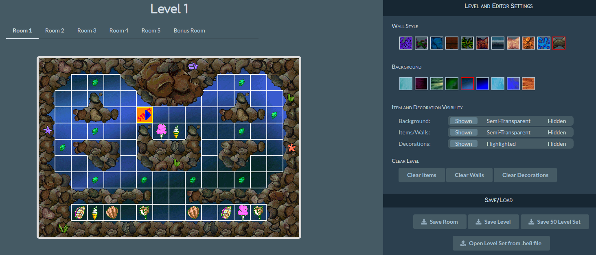

# Maze Madness Editor

This repo hosts a browser-based application for creating custom levels for Maze Madness. It can load levels from `maze.he8`, which can be found in the Maze Madness root directory. On a default Windows installation, this will typically be found under `C:\hegames`.

**Try it now**: https://hatteringill.github.io/maze-madness-editor. No installation required.

**Be careful**: because this is a browser-based application, there is *NO* autosave functionality. If your browser crashes, battery dies, etc. your progress *will be lost*. Use the save button frequently so you can reload if needed.



Use the left-hand pane to select levels to edit. The controls on the bottom can be used to update items, walls, and decorations. The controls on the right can be used to change the wall style or background. All walls are "auto" by default, meaning they will adjust their orientation as walls around them change, but this can be adjusted in the "Place Wall" panel at the bottom.

Once done editing a set of levels, click the "Save 50 Level Set" button to download the edited levels in .he8 format. Simply copy this file back into the game directory in place of the original to test the levels. If you want to edit your custom set later, you can click the "Open Level Set from .he8 file" button and upload the custom maze.he8 file.

## Support

This tool is made available for free. If you like using it, consider contributing.

**Bitcoin**: bc1qa3lup95ueeuvzh8mctjv23vvuzrnfjchy8994r

**Ethereum**: 0xB18BF05EfD7aB6835a5c6C2c5d08ac1eb8B170a9

## For developers

To run locally, first [install the Yarn package manager](https://classic.yarnpkg.com/lang/en/docs/install), then:

1. Clone the repository and install the dependencies
```bash
yarn install
```
2. Start the frontend application locally
```bash
yarn start
```
